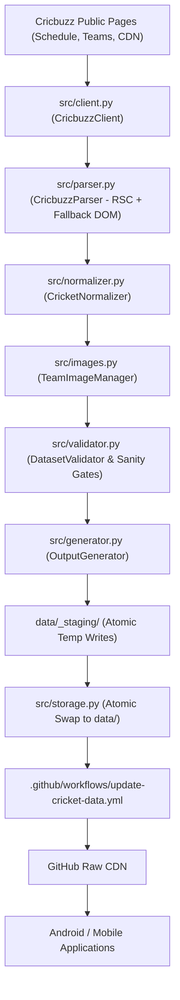

# Cricket Data Repository Architecture

## 1. Overview

The Cricket Data Repository (`cricket-data-hash`) provides an automated, reliable data pipeline that fetches raw cricket fixture data from public web sources (Cricbuzz), normalizes and enriches the records, caches local brand and team assets, validates datasets against strict data integrity rules and parity thresholds, and commits updated JSON datasets and images to GitHub.

Android and mobile applications consume raw files directly from GitHub over HTTPS, completely eliminating direct mobile scraping or third-party API keys.

---

## 2. End-to-End System Architecture

---

## 3. Core Component Layers

### 3.1 Source Client (`src/client.py`)
- Manages HTTP requests to Cricbuzz with standard browser headers and desktop `User-Agent`.
- Implements exponential backoff retry policies (`urllib3.util.Retry`).
- Configurable timeouts and inter-request polite throttling.
- Saves raw snapshot payloads to `raw/latest_schedule.json` or `raw/latest_schedule.html` with bounded retention for offline debugging and parser regression verification.

### 3.2 Parser (`src/parser.py`)
- **Primary RSC Engine**: Decodes Next.js React Server Component `self.__next_f.push` payloads. Extracts structured JSON `scheduleData` containing `matchScheduleMap`.
- **Fallback A**: Balanced-brace JSON scanner searching for `{"scheduleData": ...}`.
- **Fallback B**: BeautifulSoup DOM parser traversing rendered match card links (`/live-cricket-scores/<id>/...`) and date headings.
- Decouples raw source representation from downstream models.

### 3.3 Normalizer (`src/normalizer.py`)
- Transforms raw dictionary structures into strongly typed internal models (`NormalizedMatch`, `NormalizedTeam`, `NormalizedSeries`, `NormalizedVenue`).
- Standardizes timestamps to UTC milliseconds epoch and ISO-8601 strings.
- Strips whitespace and normalizes team short codes and match formats.
- Maps categories (`INTERNATIONAL`, `T20_LEAGUE`, `DOMESTIC`, `WOMEN`, `OTHER`).
- Eliminates duplicate matches using unique match IDs.

### 3.4 Team Asset Manager (`src/images.py`)
- Detects newly discovered teams or missing team logos.
- Fetches team logos from Cricbuzz's CDN (`https://static.cricbuzz.com/a/img/v1/0x0/i1/c{imageId}/i.jpg`).
- Uses **Pillow** to:
  - Verify image integrity and valid dimensions (> 10x10 px).
  - Reject HTML error responses or corrupt byte streams.
  - Reject 1x1 transparent placeholder GIFs.
  - Standardize and save to `images/teams/{teamId}.png`.
- Reuses existing cached assets without redundant network requests.

### 3.5 Validator & Sanity Gates (`src/validator.py`)
- Runs automated data integrity assertions:
  - No duplicate match IDs in any output.
  - Valid team IDs (both `teamAId` and `teamBId` present and distinct).
  - Valid start timestamps (must be positive epoch ms and within plausible date bounds).
  - Team names non-empty.
  - Venue and city present.
  - Referenced team logos exist on disk.
- **Sanity Drop Threshold**: If an existing dataset contains active matches (e.g. 50 matches) and a new scrape run returns 0 or suspiciously low matches (< 30% of previous baseline), the run fails with a `SuspiciousDataDropError` and leaves the existing production dataset completely untouched.

### 3.6 Output Generator & Storage (`src/generator.py`, `src/storage.py`)
- Generates all target JSON files:
  - `data/matches/today.json`
  - `data/matches/tomorrow.json`
  - `data/matches/upcoming.json`
  - `data/matches/all.json`
  - `data/matches/international.json`
  - `data/matches/t20_leagues.json`
  - `data/matches/domestic.json`
  - `data/matches/women.json`
  - `data/teams/teams.json`
  - `data/series/series.json`
  - `data/venues/venues.json`
  - `data/index.json`
- **Atomic Writes**: All output files are initially written to a staging directory (`data/_staging/`). Full validation is executed on the staged files. Only upon 100% validation success are staged files atomically moved to replace production files.

---

## 4. Timezone Strategy

- **Canonical Match Timestamps**: Timestamps are stored in UTC (`startTime` in epoch ms, `startTimeUtc` in ISO-8601 UTC).
- **Convenience Partitioning (`today.json` / `tomorrow.json`)**: Configured with a default timezone of `Asia/Karachi` (PKT, UTC+5). Dates are evaluated at midnight boundaries in the target timezone.

---

## 5. Extensibility Roadmap

The modular architecture cleanly supports future cricket features without structural rewrites:
- **Live Scores**: Add a `LiveScoreScraper` populating `data/matches/live.json`.
- **Match Results & Scorecards**: Add scorecard parser outputting `data/scorecards/{matchId}.json`.
- **Match Posters & Graphics**: The team model retains `primaryColor`, `secondaryColor`, and high-res team logos ready for headless canvas/Pillow image generation.
- **Squads & Players**: Add `data/players/players.json` and `data/squads/{seriesId}_{teamId}.json`.
